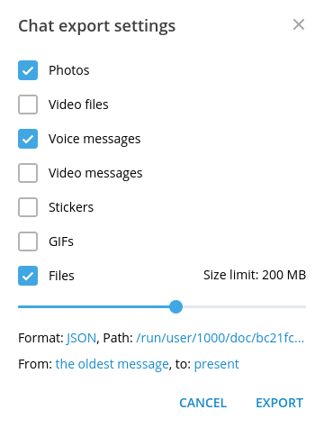

# tg2md

This script parses output from Telegram channel or group and converts each post to
a Markdown file.

Telegram Desktop creates JSON file, as well as different directories containing
multimedia, photos, etc. This script creates new directory and populates it with
formatted posts. As a result, the folder containing original media subfolders
and this newly created formatted posts folder could be opened in Obsidian as a vault.

In Obsidian, all links between the channel/group posts are converted to wiki links,
all photos and other media display embedded in pages like in Telegram.

## easy usage on Windows

### For chats with alias
I.e. for chats where links to messages look like https://t.me/samuprav/342

1. Put `tg2md.py` and `tg2md-link_alias.bat` to the same folder where `result.json` and other exported stuff resides.
2. Edit `tg2md-link_alias.bat` and replace `<chat_alias>` with actual chat alias (like `samuprav` in the example above).
3. Run `tg2md-link_alias.bat`. `posts` subfolder containing posts will be created by the script.
4. Check the result by opening the folder as vault in Obsidian.
5. If the result is OK for you and links inside the vault work fine, delete `tg2md-link_alias.bat`, `tg2md.py`, and `result.json`.

### For private chats or chats without alias

I.e. for chats where links to messages look like https://t.me/c/5345344532/342

1. Put `tg2md.py` and `tg2md.bat` to the same folder where result.json and other exported stuff resides.
2. Run `tg2md.py`.  `posts` subfolder containing posts will be created by the script.
3. Check the result by opening the folder as vault in Obsidian.
4. If the result is OK for you and links inside the vault work fine, delete `tg2md-link_alias.bat`, `tg2md.py`, and `result.json`.

## basic usage

Firstly you need to export your channel history from Telegram Desktop app.
This could be done from three dots menu. Then popup menu appears, where
you can choose what data you want to export. The script currently supports
only photos, voice messages and audio files.



In format menu you should specify 'Machine-readable JSON' file and then
locate to directory of your desire.

To convert your posts to markdown files you need to run `tg2md.py` program
which takes path to your `result.json` file as first argument.

```console
$ python tg2md.py path/to/result.json
```

By default it will create `posts` directory in your current directory
and populate it with markdown files. If you want to specify other location,
use `--out-dir` flag

```console
$ python tg2md.py result.json --out-dir path/to/post/output
```

For correct linking of posts, please specify channel alias ('@name' without @)
using the `--alias` parameter. I.e. for `https://t.me/samuprav`:

```console
$ python tg2md.py result.json --alias samuprav
```

You can also customize names of directories for storing media files instead
of default `photos` and `files` by specifying them with `--photo-dir` and
`--media-dir` parameters respectively. Note that they only change links in the
markdown files. This actually does not make sense for Obsidian and will be removed.

## todo

- [x] replies (prev post transcluded)
- [x] wiki-links and external links
- [x] links to original Telegram posts
- [x] post author tag for groups
- [x] `yyyy-mm` subfolders to output posts folder
- [ ] single/muliple tags
- [ ] forwarded posts
- [ ] custom post header
